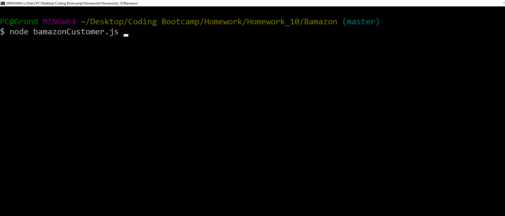
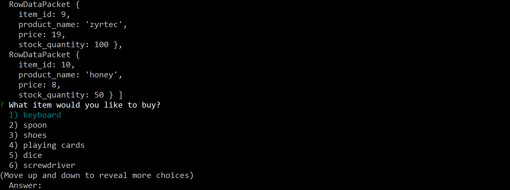
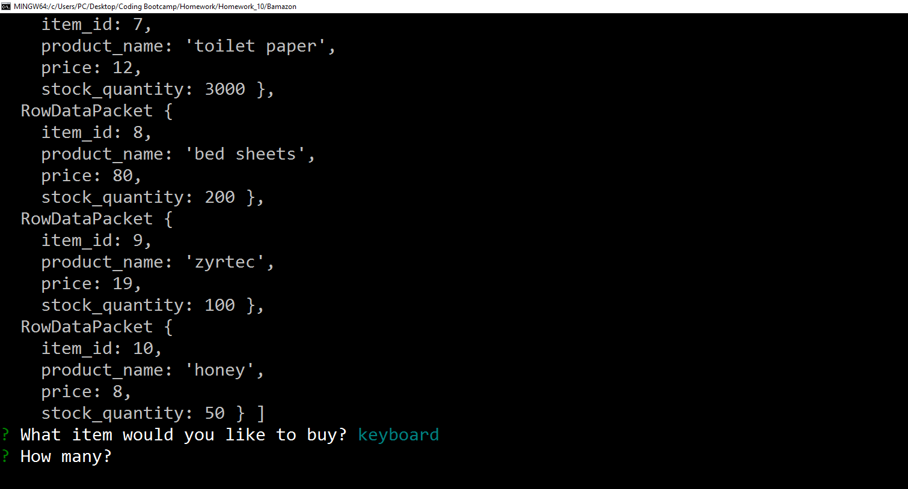
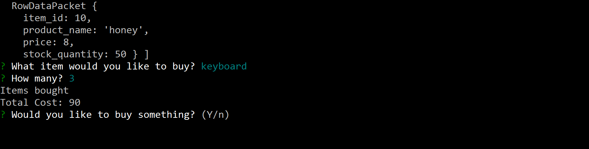

# Bamazon

First make sure you have done an npm install then run the bamazonCustomer.js using node.

Pick wheather or not to buy something.

Pick what to buy by typing the item number then pressing enter.

Type the quantity of the item to be purchased.

Should return either not enough of the item left or the total cost of the items being purchased.

